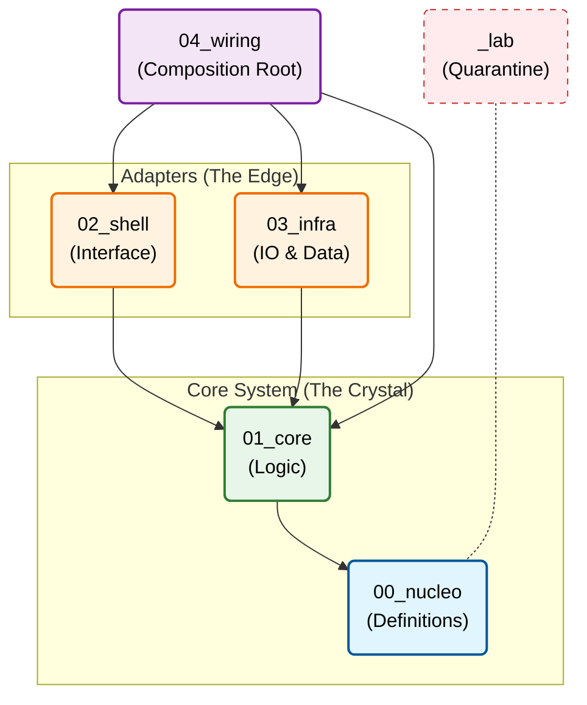

### 1. README.md (English Version)

# Crystalline Architecture Standard

<div align="center">

**A structural framework for AI-assisted software development**

</div>

---

## 💎 Mathematical Foundation

The Crystalline Standard treats software architecture as a **Topological Space** governed by strict laws to minimize structural entropy $H$.

* **System Topology ($\mathcal{T}$)**: The project is a Directed Acyclic Graph (DAG) where nodes are layers $L_n$ and edges are dependency morphisms.
* **Dependency Poset**: The system follows a partial order: $L_0 \to L_1 \to \{L_2, L_3\} \to L_4$ where $L_0$ (Nucleus) is the absolute **infimum** ($\inf$).
* **Entropy Control**: We enforce the **Nucleation Invariant**:$Code \neq \emptyset \iff Spec \neq \emptyset$.

---

## Quick Start

```bash
# Clone as template
git clone https://github.com/your-org/crystalline-architecture-standard.git my-project

# Or copy structure
cp -r crystalline-architecture-standard/0* my-project/
cp -r crystalline-architecture-standard/_lab my-project/

```

---

## The Lattice

The physical structure acts as a "hardware constraint" for AI logic generation.

```
your-project/
├── 00_nucleo/     # 📋 Specifications, ADRs, Contracts (The Seed)
├── 01_core/       # 💎 Pure logic, zero I/O (The Crystal)
├── 02_shell/      # 🖥️  UI, API, CLI (Primary Adapters)
├── 03_infra/      # 🔌 Database, Network (Secondary Adapters)
├── 04_wiring/     # ⚡ Dependency Injection, main() (The Composition)
└── _lab/          # 🧪 Experiments (Quarantine)

```

---

## Core Principles

| # | Principle | Formal Property | Description |
| --- | --- | --- | --- |
| 1 | **Nucleation** | **Axiomatization** | Specifications before code. No spec = No code. |
| 2 | **Containment** | **Topological Boundary** | Folder structure as a physical barrier. |
| 3 | **Gravity** | **Directed Equality** | Dependencies flow outward only ($L_n \to L_{n-1}$). |
| 4 | **Darwinism** | **Isolation** | Lab code never enters production without refactoring. |

---

---

## Dependency Rules

---

## AI Protocol

To maintain **Structural Isomorphism** between specification and implementation:

1. **Read First**: AI must ingest `00_nucleo/` to load the project's "genetic code".
2. **Nucleation Lock**: Implementation is a function of specification: $f(Spec) \to Code$.
3. **Lineage Tracing**: Every file must have a traceable morphism to a spec in `00_nucleo`.
4. **Isomorphism Audit**: Verify if implementation mirrors the contract structure $1:1$.

---

## Documentation / Documentação

| Document | Description |
|----------|-------------|
| [MANIFESTO.md](./MANIFESTO.md) | Complete philosophy and rules |
| [00_nucleo/README.md](./00_nucleo/README.md) | Nucleus layer guide |
| [01_core/README.md](./01_core/README.md) | Core layer guide |
| [02_shell/README.md](./02_shell/README.md) | Shell layer guide |
| [03_infra/README.md](./03_infra/README.md) | Infrastructure layer guide |
| [04_wiring/README.md](./04_wiring/README.md) | Wiring layer guide |
| [_lab/README.md](./_lab/README.md) | Lab quarantine rules |

---

## Industry Mapping

| Crystalline | Clean Architecture | Hexagonal | DDD |
| --- | --- | --- | --- |
| `00_nucleo` | — | — | Ubiquitous Language |
| `01_core` | Entities | Application Core | Domain Layer |
| `02_shell` | Interface Adapters | Primary Adapters | Application Layer |
| `03_infra` | Frameworks & Drivers | Secondary Adapters | Infrastructure |
| `04_wiring` | Main | — | Composition Root |

---
