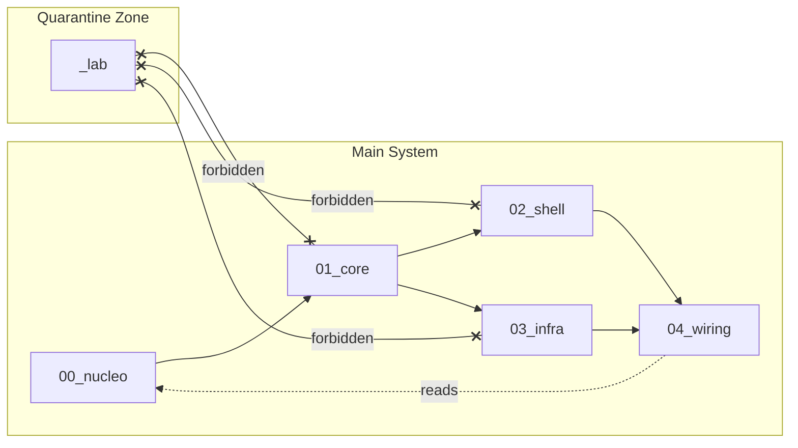

# Crystalline Architecture Standard
# Padrão de Arquitetura Cristalina

<div align="center">

**A structural framework for AI-assisted software development**  
**Um framework estrutural para desenvolvimento de software assistido por IA**

[](./MANIFESTO.md)
[](./LICENSE)

</div>

---

## Quick Start / Início Rápido

```bash
# Clone as template / Clone como template
git clone https://github.com/your-org/crystalline-architecture-standard.git my-project

# Or copy structure / Ou copie a estrutura
cp -r crystalline-architecture-standard/0* my-project/
cp -r crystalline-architecture-standard/_lab my-project/
```

---

## The Lattice / O Retículo

```
your-project/
├── 00_nucleo/     # 📋 Specifications, ADRs, Contracts
├── 01_core/       # 💎 Pure logic, zero I/O
├── 02_shell/      # 🖥️  UI, API, CLI (Primary Adapters)
├── 03_infra/      # 🔌 Database, Network (Secondary Adapters)
├── 04_wiring/     # ⚡ Dependency Injection, main()
└── _lab/          # 🧪 Experiments (quarantined)
```

---

## Core Principles / Princípios Fundamentais

| # | Principle / Princípio | Description / Descrição |
|---|----------------------|-------------------------|
| 1 | **Nucleation** | Specifications before code / Especificações antes do código |
| 2 | **Containment** | Folder structure as physical barrier / Estrutura de pastas como barreira física |
| 3 | **Gravity** | Dependencies flow outward only / Dependências fluem apenas para fora |
| 4 | **Darwinism** | Lab code never enters production directly / Código do lab nunca entra direto em produção |

---

## Dependency Rules / Regras de Dependência



| Layer | Can Import | Cannot Import |
|-------|------------|---------------|
| `01_core` | `00_nucleo` (specs only) | `02_shell`, `03_infra`, `04_wiring` |
| `02_shell` | `01_core` | `03_infra` |
| `03_infra` | `01_core` | `02_shell` |
| `04_wiring` | All (00-03) | — |
| `_lab` | External libs only | Any (00-04) |

---

## AI Protocol / Protocolo de IA

For AI agents (Cursor, Copilot, Gemini, Claude):

Para agentes de IA (Cursor, Copilot, Gemini, Claude):

1. **Read First** — Always read `00_nucleo/` before generating code
2. **Nucleation Lock** — No code without specification
3. **Lineage Tracing** — Every file must trace to a spec
4. **Isomorphism Audit** — Verify implementation matches spec

See [.cursorrules](./.cursorrules) and [.agentrules](./.agentrules) for machine-readable protocols.

---

## Documentation / Documentação

| Document | Description |
|----------|-------------|
| [MANIFESTO.md](./MANIFESTO.md) | Complete philosophy and rules / Filosofia e regras completas |
| [00_nucleo/README.md](./00_nucleo/README.md) | Nucleus layer guide |
| [01_core/README.md](./01_core/README.md) | Core layer guide |
| [02_shell/README.md](./02_shell/README.md) | Shell layer guide |
| [03_infra/README.md](./03_infra/README.md) | Infrastructure layer guide |
| [04_wiring/README.md](./04_wiring/README.md) | Wiring layer guide |
| [_lab/README.md](./_lab/README.md) | Lab quarantine rules |

---

## Industry Standard Mapping / Mapeamento para Padrões

| Crystalline | Clean Architecture | Hexagonal | DDD |
|-------------|-------------------|-----------|-----|
| `00_nucleo` | — | — | Ubiquitous Language |
| `01_core` | Entities | Application Core | Domain Layer |
| `02_shell` | Interface Adapters | Primary Adapters | Application Layer |
| `03_infra` | Frameworks & Drivers | Secondary Adapters | Infrastructure |
| `04_wiring` | Main | — | Composition Root |

---

## License / Licença

MIT License — Use freely in any project.

MIT License — Use livremente em qualquer projeto.
