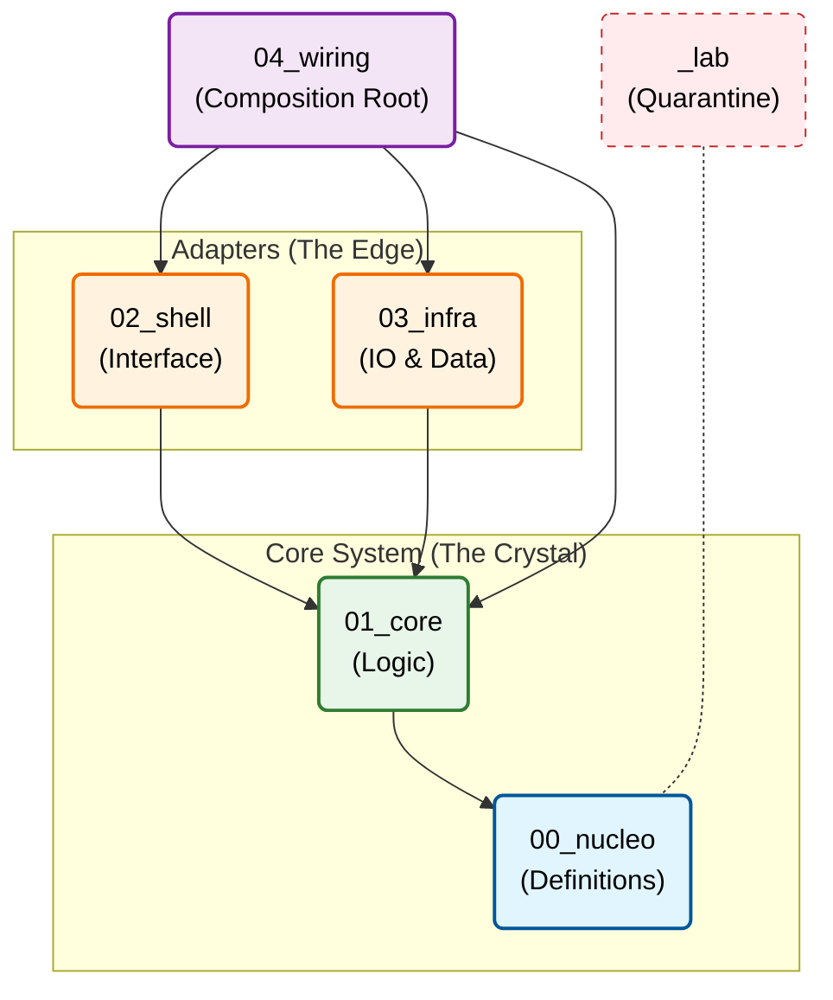

### 2. README.pt.md (Versão em Português)

# Padrão de Arquitetura Cristalina

<div align="center">

**Um framework estrutural para desenvolvimento de software assistido por IA**

</div>

---

## 💎 Fundamentação Matemática

O Padrão Cristalino trata a arquitetura de software como um **Espaço Topológico** regido por leis estritas para minimizar a entropia estrutural $H$.

* **Topologia do Sistema ($\mathcal{T}$)**: O projeto é um Grafo Acíclico Direcionado (DAG) onde os nós são camadas $L_n$ e as arestas são morfismos de dependência.
* **Poset de Dependência**: O sistema segue uma ordem parcial: $L_0 \to L_1 \to \{L_2, L_3\} \to L_4$ onde $L_0$ (Núcleo) é o **ínfimo** ($\inf$) absoluto.
* **Controle de Entropia**: Aplicamos a **Invariante de Nucleação**: $Código \neq \emptyset \iff Espec \neq \emptyset$.

---

## Início Rápido

```bash
# Clone como template
git clone https://github.com/your-org/crystalline-architecture-standard.git meu-projeto

# Ou copie a estrutura
cp -r crystalline-architecture-standard/0* meu-projeto/
cp -r crystalline-architecture-standard/_lab meu-projeto/

```

---

## O Retículo

A estrutura física atua como uma "restrição de hardware" para a geração de lógica pela IA.

```
seu-projeto/
├── 00_nucleo/     # 📋 Especificações, ADRs, Contratos (A Semente)
├── 01_core/       # 💎 Lógica pura, zero I/O (O Cristal)
├── 02_shell/      # 🖥️  UI, API, CLI (Adaptadores Primários)
├── 03_infra/      # 🔌 Banco de Dados, Rede (Adaptadores Secundários)
├── 04_wiring/     # ⚡ Injeção de Dependência, main() (A Composição)
└── _lab/          # 🧪 Experimentos (Quarentena)

```

---

## Princípios Fundamentais

| # | Princípio | Propriedade Formal | Descrição |
| --- | --- | --- | --- |
| 1 | **Nucleação** | **Axiomatização** | Especificações antes do código. Sem spec = Sem código. |
| 2 | **Contenção** | **Fronteira Topológica** | Estrutura de pastas como barreira física. |
| 3 | **Gravidade** | **Igualdade Direcionada** | Dependências fluem apenas para fora ($L_n \to L_{n-1}$). |
| 4 | **Darwinismo** | **Isolamento** | Código de laboratório nunca entra em produção sem refatoração. |

---

## Dependency Rules / Regras de Dependência

---

## Protocolo de IA

Para manter o **Isomorfismo Estrutural** entre especificação e implementação:

1. **Leitura Prévia**: A IA deve ler o `00_nucleo/` para carregar o "código genético" do projeto.
2. **Trava de Nucleação**: A implementação é uma função da especificação: $f(Espec) \to Código$.
3. **Rastreamento de Linhagem**: Cada arquivo deve ter um morfismo rastreável para uma spec no `00_nucleo`.
4. **Auditoria de Isomorfismo**: Verificar se a implementação espelha a estrutura do contrato em $1:1$.

---

## Documentation / Documentação

| Document | Description |
|----------|-------------|
| [MANIFESTO.md](./MANIFESTO.md) | Filosofia e regras completas |
| [00_nucleo/README.md](./00_nucleo/README.md) | Guia da camada Nucleus |
| [01_core/README.md](./01_core/README.md) | Guia da camada Core |
| [02_shell/README.md](./02_shell/README.md) | Guia da camada Shell |
| [03_infra/README.md](./03_infra/README.md) | Guia da camada Infrastructure |
| [04_wiring/README.md](./04_wiring/README.md) | Guia da camada Wiring |
| [_lab/README.md](./_lab/README.md) | Regras da quarentena Lab |

## Mapeamento de Padrões

| Cristalina | Clean Architecture | Hexagonal | DDD |
| --- | --- | --- | --- |
| `00_nucleo` | — | — | Linguagem Ubíqua |
| `01_core` | Entidades | Core da Aplicação | Camada de Domínio |
| `02_shell` | Adaptadores de Interface | Adaptadores Primários | Camada de Aplicação |
| `03_infra` | Frameworks & Drivers | Adaptadores Secundários | Infraestrutura |
| `04_wiring` | Main | — | Composição (Root) |

---
